## Feature Selection and Feature Extraction

### Example 1: Prostate Cancer

- <b>Response</b>: level of prostate-specific antigen (lpsa). 
- <b>Initial Feature Set</b>:
$$\{lcavol, lweight, age, lbph, svi, lcp, gleason, pgg45\}.$$
- <b>Task</b>:
    - predict $lpsa$ from measurements of features

Feature selection
- Cost: Measuring features cost money
- Interpretation: Doctors can see which features are important

---

## Feature Selection and Feature Extraction

### Example 2: classification with fMRI data

- fMRI data are 4D images, with one dimension being time. 

- Each image is ~ $50 \times 50 \times 50$(spatial) $\times 200$(times) $= 25M$ dimensions

Feature extraction 
- Individual voxel-times are not important 
- Cost is not correlated with #features
- Feature extraction offers more flexibility in transforming features, which potentially results in better accuracy

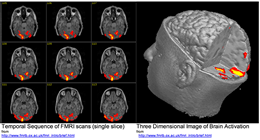

---

## Feature Selection Methods

### Wrapper Methods

- Search the space of feature subsets
- Use the cross validation accuracy w.r.t. a specific classifier as the measure of utility for a candidate subset
- e.g. see how it works for a feature set {1, 2, 3} in the figure below
    - $1,2$, and $3$ represent the $1st$, $2nd$ and $3rd$ feature respectively

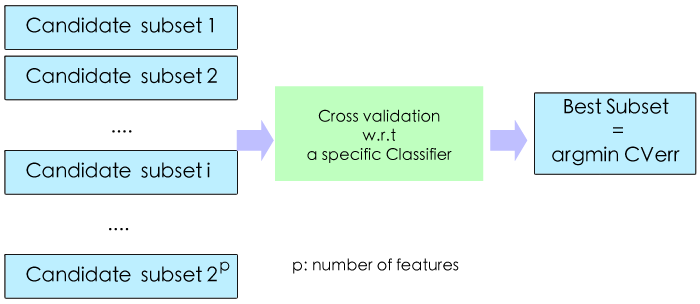

---

## Feature Selection Methods

### Embedded Methods
- exploit the structure of specific classes of learning models to guide the feature selection process
- embedded as part of the model construction process
    - e.g. LASSO. 

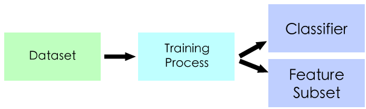

---

## Feature Selection Methods

### Filter Methods

- use some general rules/criterions to measure the feature selection results independent of the classifiers
- e.g. mutual information

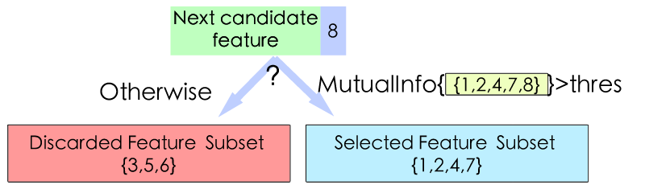

---

## Feature Selection

### Comparison

|               | Wrapper       | Filter| Embedded|
| ----------- |:-------------:| -----:|-----:|
| Computational Speed               | Low     | High  | Mid|
| Chance of Overfitting| High   | Low   | Mid|
| Classifier-Independent | No   | Yes   | No  |

- Wrapper methods have the strongest learning/representation capability among the three
    - often fit training dataset better than the other two
    - prone to overfitting for small datasets
    - require more data to reliably get a near-optimal approximation. 

--- &twocolportion w1:50% w2:48%

## Feature Extraction   

*** left

### Principle Components Analysis

- <b>A graphical explanation</b>
    - Each data sample has three features
    - Original features are transformed into new ones
    - Often use only the new features with largest variance
- <b>Example</b>
    - For fMRI images, we usually have millions of dimensions. PCA can project the data from millions of dimensions to only thousands of dimensions, or even less
- Other feature extraction methods: ICA, Kernel PCA , etc..

*** right

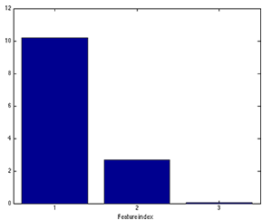

---

## Part 2: Linear Regression and Least Squares (Review)

1. Introduction to Dimensionality Reduction
2. <b>Linear Regression and Least Squares (Review)</b>
    - <b>Least Square Fit</b>
    - <b>Gauss Markov</b>
    - <b>Bias-Variance tradeoff</b>
    - <b>Problems</b>
3. Subset Selection
4. Shrinkage Methods
5. Beyond LASSO

--- &twocolportion w1:58% w2:38%

## Linear Regression and Least Squares (Review)

*** left

### Least Squares Fit

$$
\begin{equation}
\begin{split}
RSS(\beta) &= (\mathbf{y} - \mathbf{X}\beta)^T(\mathbf{y} - \mathbf{X}\beta)\\
\frac{\partial RSS}{\partial \beta} &= -2 \mathbf{X}^T(\mathbf{y} - \mathbf{X}\beta) = 0
\quad \Rightarrow \quad \hat{\beta}^{ls} = (\mathbf{X}^T\mathbf{X})^{-1}\mathbf{X}^T\mathbf{y}
\end{split}
\end{equation}
$$

### Gauss Markov Theorem

The least squares estimates $\hat{\beta}^{ls}$ of the parameters β have the smallest variance among all linear unbiased estimates.

### Question

Is it good to be unbiased?

*** right

---

## Linear Regression and Least Squares (Review)

### Bias-Variance tradeoff

$$
\begin{equation}
\begin{split}
MSE(\hat{\mathbf{y}}) &= E[(\hat{\mathbf{y}} - Y)^2]\\
&= Var(\hat{\mathbf{y}}) + [E[\hat{\mathbf{y}}] - Y]^2
\end{split}
\end{equation}
$$

   
   
where $Y = X^T\beta$. We can trade increase in bias for much less variance.

### Problems of Least Squares

- <b>Prediction accuracy</b>: unbiased, but higher variance than many biased estimator (leading to higher MSE), overfitting noise and sensitive to outliers
- <b>Interpretation</b>:  $\hat{\beta}$ involves all of the features.
Better to have SIMPLER linear model, that involves only a few features...
- Recall that $\hat{\beta}^{ls} = (\mathbf{X}^T\mathbf{X})^{-1}\mathbf{X}^T\mathbf{y}$
    - $(\mathbf{X}^T\mathbf{X})$ may be <b>not invertible</b> and thus no closed form solution

---

## Part 3: Subset Selection Methods

1. Introduction to Dimensionality Reduction
2. Linear Regression and Least Squares (Review)
3. <b>Subset Selection</b>
  - <b>Best-subset selection</b>
  - <b>Forward stepwise selection</b>
  - <b>Forward stagewise selection</b>
  - <b>Problems</b>
4. Shrinkage Methods
5. Beyond LASSO

---

## Subset Selection Methods

### Best-subset selection

- Best subset regression finds for each $k \in \{0, 1, 2, . . . , p\}$ the subset of features of size $k$ that gives smallest RSS. 
- Then cross validation is utilized to choose the best $k$
- An efficient algorithm, the leaps and bounds procedure (Furnival and Wilson, 1974), makes this feasible for $p$ as large as 30 or 40.

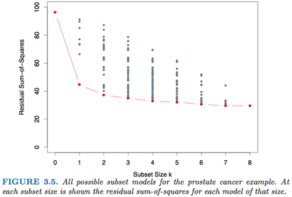

---

## Subset Selection Methods

### Forward-STEPWISE selection

Instead of searching all possible subsets, we can seek a good path through them. 

- a <b>sequential greedy</b> algorithm.

*Forward-Stepwise Selection* builds a model sequentially, adding one variable at a time. 
- Initialization
    - Active set $\mathcal{A} = \emptyset$, $\mathbf{r} = \mathbf{y}$, $\beta = 0$
- At each step, it
    - identifies the best variable (with the highest correlation with the residual error)
$$\mathbf{k} = argmax_{j}(|correlation(\mathbf{x}_j, \mathbf{r})|)$$
    - $A = A \cup \{\mathbf{k}\}$
    - then updates the least squares fit $\beta$, $\mathbf{r}$ to include all the active variables

--- &twocolportion w1:55% w2:43%

## Subset Selection Methods

### Forward-STAGEWISE Regression

*** left
- Initialize the fit vector $\mathbf{f} = 0$
- For each time step
    - Compute the correlation vector 
    $$\mathbf{c} = (\mathbf{c}_1, ..\mathbf{c}_p)$$
        - $\mathbf{c}_j$ represents the correlation between $\mathbf{x}_j$ and the residual error
    - $k = argmax_{j \in \{1,2,..,p\}} |\mathbf{c}_j|$
    - Coefficients and fit vector are updated
$$\mathbf{f} \gets \mathbf{f} + \alpha \cdot sign(\mathbf{c}_k) \mathbf{x}_k$$
$$\beta_k \gets \beta_k + \alpha \cdot sign(\mathbf{c}_k)$$ 
where $\alpha$ is the learning rate

***right

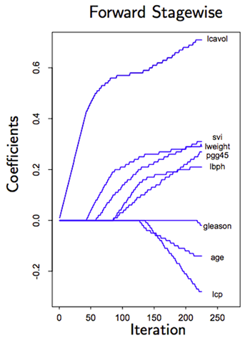

---&twocolportion w1:40% w2:55%

## Subset Selection Methods

### Comparison
*** left
- Forward-STEPWISE selection: 
    - algorithm stops in $p$ steps
- Forward-STAGEWISE selection: 
    - is a slow fitting algorithm, at each time step, only $\beta_k$ is updated. Alg can take more than $p$ steps  to stop

*** right

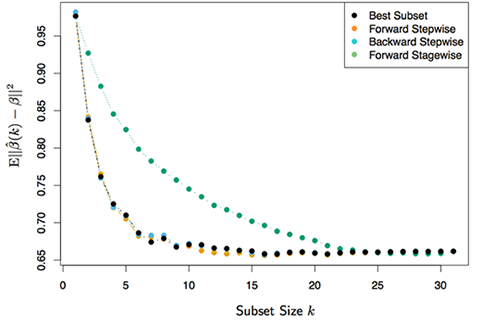

- $N = 300$ Observations, $p = 31$ features
- averaged over 50 simulations

---

## Summary of Subset Selection Methods

### Advantages w.r.t Least Squares

- More interpretable result
- More compact model

### Disadvantages w.r.t. Continuos Process

- It is a discrete process, and thus has high variance and is very sensitive to changes in the dataset
    - If the dataset changes a little, the feature selection result may be very different   

---

## Part 4: Shrinkage Methods

1. Introduction to Dimensionality Reduction
2. Linear Regression and Least Squares (Review)
3. Subset Selection
4. <b>Shrinkage Methods</b>
    - <b>Ridge Regression</b>
        - <b>Formulations and closed form solution</b>
        - <b>Singular value decomposition</b>
        - <b>Degree of Freedom</b>
    - LASSO
5. Beyond LASSO

---

## Ridge Regression

- <b>Least squares with quadratic constraints</b>
$$
\begin{equation}
\hat{\beta}^{ridge}= argmin_{\beta}\sum_{i=1}^N(y_i - \beta_0 - \sum_{j=1}^p\mathbf{x}_{ij}\beta_j)^2, \quad s.t. \quad \sum_{j = 1}^p \beta_j^2 \leq t
\end{equation}
$$
- <b>Its Lagrange form</b>
$$
\hat{\beta}^{ridge} = argmin_{\beta}\sum_{i=1}^N(y_i - \beta_0 - \sum_{j=1}^p\mathbf{x_{ij}}\beta_j)^2 + \lambda \sum_{j = 1}^p\beta_j^2
$$
- The $l_2$-regularization can be viewed as a Gaussian prior on the coefficients, our solution as the posterior means

- <b>Solution</b>

$$
\begin{equation}
\begin{split}
&RSS(\beta) = (\mathbf{y} - \mathbf{X}\beta)^T(\mathbf{y} - \mathbf{X}\beta) + \lambda \beta^T\beta\\
&\partial RSS(\beta)/ \partial \beta = 0  \quad \Rightarrow\quad \hat{\beta}^{ridge} = (\mathbf{X}^T\mathbf{X} + \lambda \mathbf{I})^{-1}\mathbf{X}^T\mathbf{y}
\end{split}
\end{equation}
$$    

---&triple w1:50% w2:50%

## Ridge Regression

### Simulation Experiment

***left

- $N = 30$
- $\mathbf{x}_1 \sim N(0, 1)$
- $\beta \sim (U(-0.5,0.5), U(-0.5,0.5))$

***right

- $\mathbf{y} = (\mathbf{x}_1, \mathbf{x}_1^2) \times \beta$
- $\mathbf{X} = (\mathbf{x}_1, \mathbf{x}^2_1, ..., \mathbf{x}^8_1)$
- Dataset avalible: {$\mathbf{X}$, $\mathbf{y}$}

*** down

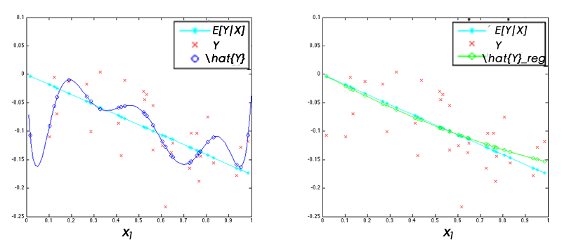

---&twocolportion w1:50% w2:50%

## Ridge Regression

### Singular Value Decomposition (SVD)
SVD offers some additional insight into the nature of ridge regression. 

*** left

- <b>The SVD of</b> $\mathbf{X}$:
$$\mathbf{X} = \mathbf{UDV}^T$$
    - $\mathbf{U}$: $N \times p$ <b>orthogonal</b> matrix with columns spanning the column space of $\mathbf{X}$. 
        - $\mathbf{u}_j$ is the $j$th column of $\mathbf{U}$
    - $\mathbf{V}$: $p \times p$ <b>orthogonal</b> matrix with columns spanning the row space of $\mathbf{X}$. 
        - $\mathbf{v}_j$ is the $j$th column of $\mathbf{V}$  
    - $\mathbf{D}$: $p \times p$ <b>diagonal</b> matrix with diagonal entries $d_1 \geq d_2 \geq ... \geq d_p \geq 0$ being the singular values of $\mathbf{X}$

*** right

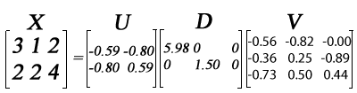

---&triple w1:50% w2:50%

## Ridge Regression

### Singular Value Decomposition (SVD)

*** left

- <b>For least squares</b>
$$
\begin{equation}
\begin{split}
\mathbf{X}\hat{\beta}^{ls} &= \mathbf{X(X^TX)^{-1}X^Ty}\\
&=\mathbf{UU^Ty} =\sum_{j=1}^p\mathbf{u}_j \mathbf{u}_j^T\mathbf{y}
\end{split}
\end{equation}
$$

*** right
- <b>For ridge regression</b>
$$
\begin{equation}
\begin{split}
\mathbf{X}\hat{\beta}^{ridge} &= \mathbf{X(X^TX + \lambda I)^{-1}X^Ty}\\
&=\sum_{j=1}^p\mathbf{u}_j\frac{d_j^2}{d_j^2 + \lambda} \mathbf{u}_j^T\mathbf{y}
\end{split}
\end{equation}
$$

*** down

- Compared with the solution of least squares, we have an additional shrinkage term 
$$\frac{d_j^2}{d_j^2 + \lambda},$$ 
the smaller $d_j$ is and the larger $\lambda$ is, the more shrinkage we have. 

---&twocolportion w1:55% w2:45%

## Ridge Regression

### Singular Value Decomposition (SVD) 

*** left

- $N = 100$, $p = 10$

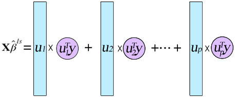

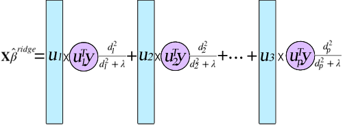

*** right

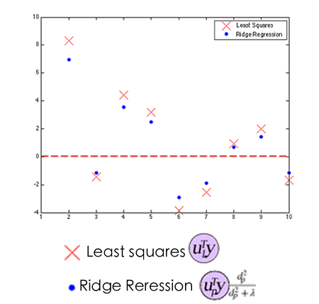

--- &twocolportion w1:50% w2:48%

## Ridge Regression

### Degree of Freedom

*** left
- The number of degrees of freedom is the number of values in the final calculation of a statistic that are free to vary. The degree of freedom of ridge estimate is related to $\lambda$, thus defined as $df(\lambda)$.
- Computation
$$
\begin{equation}
\begin{split}
df(\lambda) &= tr[\mathbf{X(X^TX + \lambda I)^{-1}X^T}]\\
&=\sum_{j=1}^p \frac{d_j^2}{d_j^2 + \lambda} 
\end{split}
\end{equation}
$$
- [larger $\lambda$] $\rightarrow$ [smaller $df(\lambda)$] $\rightarrow$ [more constrained model]
- The red line gives the best $df(\lambda)$ identified from cross validation

*** right

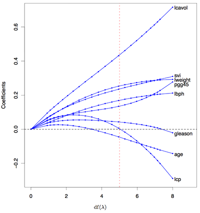

---

## Ridge Regression

#### Advantages 

-  w.r.t. Least Squares
    - $(\mathbf{X^TX + \lambda I})$ is always invertible and thus the closed form solution always exist
    - Ridge regression controls the complexity with regularization term via $\lambda$, which is less prone to overfitting compared with least squares fit, 
    - Possibly higher prediction accuracy, as the estimates of ridge regression trade a little bias for less variance
-  w.r.t. Subset Selection Methods
    - Ridge regression is a continuous shrinkage method that has less variance than subset selection methods

---

## Ridge Regression

#### Disadvantages w.r.t. Subset Selection Methods

- Compactness: 
    - Computational efficiency: 
        - though we have a closed form solution, computing matrix inversions takes time and memory
        - it takes longer to predict for future samples with more features
- Interpretation        
    - offers little interpretations 

---

## Part 4: Shrinkage Methods - LASSO

1. Introduction to Dimensionality Reduction
2. Linear Regression and Least Squares (Review)
3. Subset Selection
4. <b>Shrinkage Methods</b>
    - Ridge Regression
    - <b>LASSO</b>
        - <b>Formulations</b>
        - <b>Comparisons with ridge regression and subset selection</b>
        - <b>Solution of LASSO</b>
        - <b>Viewed as approximation for $l_0$-regularization</b>
5. Beyond LASSO

---

## LASSO

### Linear regression with $l_1$-regularization

- <b>Formulations</b>

    
    - <b>Least squares with constraints</b>
$$
\begin{equation}
\hat{\beta}^{LASSO}= argmin_{\beta}\sum_{i=1}^N(y_i - \beta_0 - \sum_{j=1}^p\mathbf{x_{ij}}\beta_j)^2, \quad s.t. \sum_{j = 1}^p |\beta_j| \leq t
\end{equation}
$$
    - <b>Its Lagrange form</b>
$$
\hat{\beta}^{LASSO} = argmin_{\beta}\sum_{i=1}^N(y_i - \beta_0 - \sum_{j=1}^p\mathbf{x_{ij}}\beta_j)^2 + \lambda \sum_{j = 1}^p|\beta_j|
$$
    - The $l_1$-regularization can be viewed as a Laplace prior on the coefficients

---&twocol

## LASSO

- $s = \frac{t}{\sum_{j=1}^p |\hat{\beta}_j|}$, where $\hat{\beta}$ is the least squares estimate
- red lines represent the $s$ and $df(\lambda)$ with the best cross validation error

*** left

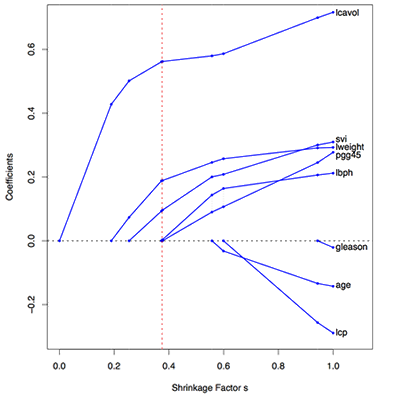

*** right

---

## LASSO

- Introduction to Dimensionality Reduction
- Linear Regression and Least Squares (Review)
- Subset Selection
- <b>Shrinkage Methods</b>
    - Ridge Regression
    - <b>LASSO</b>
        - Formulations
        - <b>Comparisons with ridge regression and subset selection</b>
            - <b>Orthonormal inputs</b>
            - <b>Non-orthonormal inputs</b>
        - Solution of LASSO
        - Viewed as approximation for $l_0$-regularization
- Beyond LASSO

---

## LASSO

### Comparison

- <b>Orthonormal Input $\mathbf{X}$</b>
    - <b>Best subset</b>: [Hard thresholding] keeps the top $M$ largest coefficeints of $\hat{\beta}^{ls}$
    - <b>Ridge</b>: [Pure shrinkage] does proportional shrinkage of $\hat{\beta}^{ls}$
    - <b>LASSO</b>: [Soft thresholding] translates each coefficient of $\hat{\beta}^{ls}$ by $\lambda$ towards 0, truncating at 0 

---&twocolportion w1:60% w2:40%

## LASSO

### Comparison

- <b>Non-orthonormal Input $\mathbf{X}$</b>

*** left

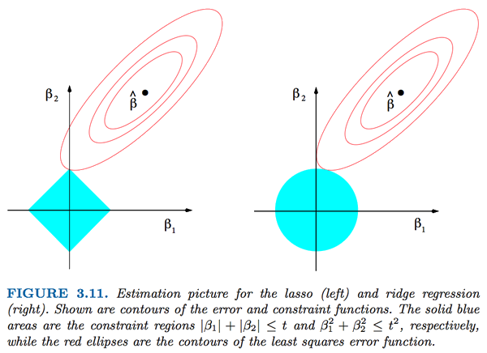

*** right

- <b>Solid blue area</b>: the constraints
    - left: $|\beta_1| + |\beta_1| \leq t$
    - right: $\beta_1^2 + \beta_1^2 \leq t^2$
- <b>$\hat{\beta}$</b>: least squares fit
- want to find the point that is nearest to  $\hat{\beta}$ , within blue region

---

## LASSO

### Other unit circles for different $p$-norms

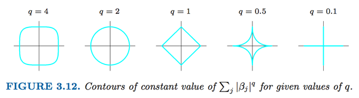

|   |Convex| Smooth| Sparse|
|----|----|----|----|
|$q<1$|No|No|Yes|
|$q>1$|Yes|Yes|No|
|$q = 1$|Yes|No|Yes|

Here $q = 0$ is the pure variable selection procedure, as it is counting the <b>number of non-zero coefficients</b>.

--- &twocolportion w1:48% w2:48%

## LASSO

### Regularizations as priors

$|\beta_j|^q$ can be viewed as the log-prior density for $\beta_j$, these three methods below are bayes estimates with different priors

- <b>Subset selection</b>: corresponds to $q = 0$
- <b>LASSO</b>: corresponds to $q = 1$, Laplace prior, $density = (\frac{1}{\tau})exp(\frac{-|\beta|}{\tau}), \tau = \sigma/\lambda$
- <b>Ridge regression</b>: corresponds to $q = 2$, Gaussian Prior, $\beta \sim N(0, \tau \mathbf{I})$, $\lambda = \frac{\sigma^2}{\tau^2}$

*** left

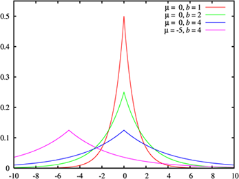

*** right

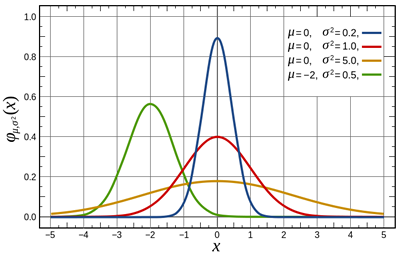

---

## LASSO

- Introduction to Dimensionality Reduction
- Linear Regression and Least Squares (Review)
- Subset Selection
- <b>Shrinkage Methods</b>
    - Ridge Regression
    - <b>LASSO</b>
        - Formulations
        - Comparisons with ridge regression and subset selection
        - <b>Solution of LASSO</b>
        - Viewed as approximation for $l_0$-regularization
- Beyond LASSO

---

## LASSO

### Quadratic Programming

- Formulation
$$
min_{\beta}\{ \frac{1}{2}(\mathbf{X}\beta - \mathbf{y})^T (\mathbf{X}\beta - \mathbf{y}) + \lambda \|\beta\|_1\}
$$
is equivalent to 
$$
min_{w, \xi}\{ \frac{1}{2}(\mathbf{X}\beta - \mathbf{y})^T (\mathbf{X}\beta - \mathbf{y}) + \lambda \mathbf{1}^T\xi\}
$$

$$
\begin{equation}
\begin{split}
s.t. &\beta_j \leq \xi_j\\
&\beta_j \geq -\xi_j
\end{split}
\end{equation}
$$

- Note that QP can only solve LASSO for a given $\lambda$. 
    - Next: method for solving for all $\lambda$ (LAR)

---&twocolportion w1:44%  w2:44%

## LAR Algorithm

*** left

### Algorithm
- Standardized all predictors; 
- $\mathbf{r}_0 = \mathbf{y} - \bar{\mathbf{y}}$; $\beta = \mathbf{0}$;
- $k = argmax_{j} |corr(\mathbf{x}_j, \mathbf{r}_0)|$, $\mathcal{A}_1 = \{k\}$    
- For time step $t = 1,2,...min(N-1,p)$
    - Move $\beta_{\mathcal{A}_t}$ in the joint least squares direction for $\mathcal{A}_t$, until some other $k \not\in \mathcal{A}_t$ has as much correlation with the current residual
    - $\mathcal{A}_{t+1} = \mathcal{A}_{t} \cup \{k\}$

*** right

### Notations

- $\beta$: $p \times 1$ coefficient vector
- $\mathcal{A}_t$: <i>active set</i>, the set indices of features included in the model at time step $t$.
    - $\bar{\mathcal{A}_t} = \{1,2,...,p\} - \mathcal{A}_t$
- $\beta_{\mathcal{A}_t}$: $|\mathcal{A}_t| \times 1$ vector of coefficients, w.r.t $\mathcal{A}_t$
    - Contains the $\beta_j, \quad j \in \mathcal{A}_t$
- $\mathbf{X}_{\mathcal{A}_t}$: $[ \mathbf{x}_j ]_{j\in \mathcal{A}_t}$
    

---&twocolportion w1:50% w2:48%

## LAR - Example

*** left

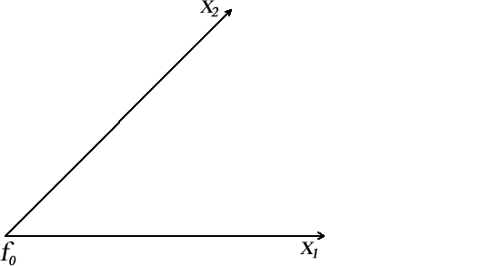

*** right
- Example Setting:
    - $N = 2$, $p = 2$
- Columnwise-standardized data matrix $\mathbf{X}$ 
    - s.t. $mean\{\mathbf{x}_j\} = 0$, $std\{\mathbf{x}_j\} = 1$
    - $\rightarrow \|\mathbf{x}_1\| = \|\mathbf{x}_2\| = ... = \|\mathbf{x}_p\|$
    - Two standardized column vectors $\mathbf{x}_1$ and $\mathbf{x}_2$ are shown in the left figure    
- $\mathcal{A}_0 = \emptyset$, which means that we have not chosen any feature yet    
- $\beta = (0, 0)^T$
- The $N\times 1$ fit vector $\mathbf{f}_0 = \mathbf{X} \beta_{\mathcal{A}_t } = 0$

    

---&twocolportion w1:55% w2:45%

## LAR - Example

*** left

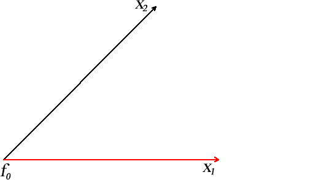

*** right

- $k = argmax_{j} |corr(\mathbf{x}_j, \mathbf{r}_0)| = 1$
- $\mathcal{A}_1 = \mathcal{A}_0 \cup \{1\} = \{1\}$

---&twocolportion w1:55% w2:45%

## LAR - Example

*** left

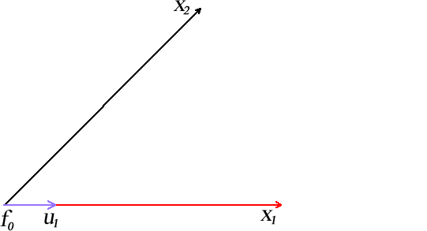

*** right

### Explanations

- $\mathbf{r}_1 = \mathbf{y} - \mathbf{X}_{\mathcal{A}_1} \beta_{\mathcal{A}_1}$ is the residual error at the beginning of time $1$
- $\delta_1 = \mathbf{(X^T_{\mathcal{A}_1} X_{\mathcal{A}_1})^{-1}X^T_{\mathcal{A}_1}r_1}$ is the least square estimates of the coefficients whose corresponding features in $\mathcal{A}_1 = \{1\}$ w.r.t. residual error $\mathbf{r}_1$
    - $\delta_1$ is the direction that coefficients $\beta_{\mathcal{A}_1}$ changes along
- $\mathbf{u}_1 = \mathbf{X}_{\mathcal{A}_1} \delta_1$
    - As $\beta_{\mathcal{A}_1}$ changes along $\delta_1$, the fit $\mathbf{f}$ changes along $\mathbf{u}_1$

---&twocolportion w1:55% w2:45%

## LAR - Example

*** left

*** right

### Comparison

- $\mathbf{r}_1$
    - $\delta_1 = \mathbf{(X^T_{\mathcal{A}_1} X_{\mathcal{A}_1})^{-1}X^T_{\mathcal{A}_1}r_1}$
    - $\mathbf{u}_1 = \mathbf{X}_{\mathcal{A}_1} \delta_1$
- $\mathbf{y}$
    - $\hat{\beta} = \mathbf{(X^T X)^{-1}X^Ty}$
    - $\hat{\mathbf{y}} = \mathbf{X} \hat{\beta}$

---&twocolportion w1:55% w2:45%

## LAR - Example

*** left

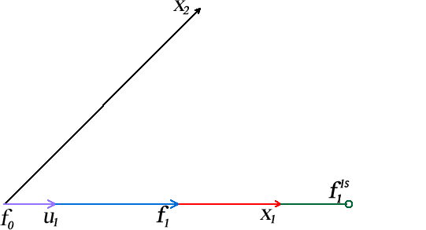

*** right

### Explanations

- As $\beta_{\mathcal{A}_1}$ moves along $\delta_1$, the correlation between the coefficient of the feature in $\mathcal{A}_1 = \{1\}$ with the residual error decreases
- $\mathbf{f}_1$, intialized as $\mathbf{f}_0$, moves along $\mathbf{u}_1$
- At last, the correlation between the coefficient of feature $k = 2$ and residual error catches up
- $\mathcal{A}_2 = \mathcal{A}_1 \cup \{2\} = \{1, 2\}$
- Note that the fit $\mathbf{f}_1$ approaches the least squares fit $\mathbf{f}_1^{ls}$, but not reach it

---&twocolportion w1:55% w2:45%

## LAR - Example

*** left

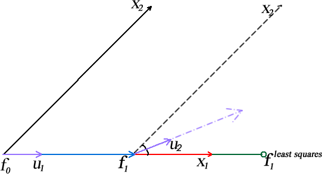

*** right

### Explanations

- The joint least squares direction, which $\beta_{\mathcal{A}_2}$ moves along, is $\delta_2 = \mathbf{(X^T_{\mathcal{A}_2} X_{\mathcal{A}_2})^{-1}X^T_{\mathcal{A}_2}r_2}$
    - $\mathbf{r}_2 = \mathbf{y} - \mathbf{X}_{\mathcal{A}_2} \beta_{\mathcal{A}_2}$
- The direction our fit move along is $\mathbf{u}_2 = \mathbf{X}_{\mathcal{A}_2} \delta_2$
    - Note that $\mathbf{u}_2$ is the bisector of $\mathbf{x}_1$ and $\mathbf{x}_2$
    - In general, $\mathbf{u}_t$ is the "bisector" of (has the same angle with) all $\mathbf{x}_j,\quad j \in \mathcal{A}_t$

---&twocolportion w1:55% w2:45%

## LAR - Example

*** left

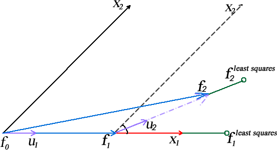

*** right

### Explanations

- As $\beta_{\mathcal{A}_2}$ moves along $\delta_2$, the fit $\mathbf{f}_2$, initialized as $\mathbf{f}_1$,
    - moves along $\mathbf{u}_2$
    - approaches $\mathbf{f}_2^{ls}$
- As we only have $p = 2$ features, finally
    - $\mathbf{f}_2 = \mathbf{f}^{ls}_2$

---

## LAR

### More Comments

- LAR solves the subset selection problem for all $t, s.t. \|\beta\| \leq t$
- LAR algorithm ends in $min(p, N-1)$ steps

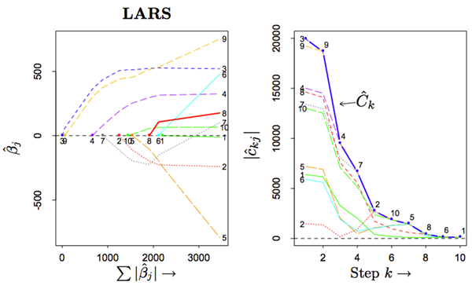

--- 

## LAR

### Result compared with LASSO

### Observations

When the blue line coefficient cross zero, LAR and LASSO become different.

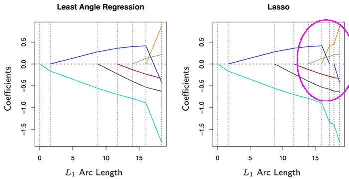

--- 

## LAR

### Result compared with LASSO

### Modification for LASSO

During the searching procedure, if a non-zero coefficient hits zero, drop this variable from $\mathcal{A}_t$, and recompute the direction $\delta_t$

---

## LAR

### Some heuristic analysis

- At a certain time point, we know that all $\mathbf{x}_j \in \mathcal{A}$ share the same absolute values of correlations with the residual error. That is
$$\mathbf{x}_j^T(\mathbf{y} - \mathbf{X}\beta) = \gamma \cdot s_j, \quad \forall j \ \in \mathcal{A}$$
where $s_j = sign(\mathbf{x}_j^T(\mathbf{y} - \mathbf{X}\beta)) \in \{-1,1\}$ and $\gamma$ is the common value. 
    - We also know that $|\mathbf{x_j}(\mathbf{y} - \mathbf{X}\beta)| \leq \gamma, \quad \forall j \not\in \mathcal{A}$

- Consider LASSO for a fixed $\lambda$. Let $\mathcal{B}$ be the set of indices of non-zero coefficients, then we differentiate the objective function w.r.t. those coefficients in $\mathcal{B}$ and set the gradient to zero. We have
$$\mathbf{x}_j^T(\mathbf{y} - \mathbf{X}\beta) = \lambda \cdot sign(\beta_j), \quad \forall j \in \mathcal{B}$$

- They are identical only if $sign(\beta_j)$ matches $s_j$. In $\mathcal{A}$, we allow for the $\beta_j$, where $sign(\beta_j) \neq sign(\mathbf{x}_j^T(\mathbf{y} - \mathbf{X}\beta))$, while this is forbidden in $\mathcal{B}$. 

---

## LAR

### Some heuristic analysis

-  LAR requires that
$$|\mathbf{x}_k^T(\mathbf{y} - \mathbf{X}\beta)| \leq \gamma, \quad \forall k \not\in \mathcal{A}$$
    - $\mathcal{A}$: set of the indices of the features with non-zero coefficients in LAR
    - $\gamma = |\mathbf{x}_j^T(\mathbf{y} - \mathbf{X}\beta)|,\quad \forall j \in \mathcal{A}$
- For LASSO, The stationary conditions require that
$$
|\mathbf{x}_k^T(\mathbf{y} - \mathbf{X}\beta)| \leq \lambda, \quad \forall k \not\in \mathcal{B}
$$
    - $\mathcal{B}$: set of the indices of the features with non-zero coefficients in LASSO
    - $\lambda$: regularization parameter
- LAR agrees with LASSO for variables with zero coefficients too.

---

## LASSO

- Introduction to Dimensionality Reduction
- Linear Regression and Least Squares (Review)
- Subset Selection
- <b>Shrinkage Methods</b>
    - Ridge Regression
    - <b>LASSO</b>
        - Formulations
        - Comparisons with ridge regression and subset selection
        Solution of LASSO
        
        - <b>Viewed as approximation for $l_0$-regularization</b>
- Beyond LASSO

---

## Viewed as approximation for $l_0$-regularization

### Pure variable selection

$$
\begin{equation}
\hat{\beta}^{ridge}= argmin_{\beta}\sum_{i=1}^N(y_i - \beta_0 - \sum_{j=1}^p\mathbf{x_{ij}}\beta_j)^2, \quad s.t. \#nonzero \beta_j \leq t
\end{equation}
$$

Actually $\#nonzero \beta_j = \|\beta\|_0$, where

$$\|\beta\|_0 = lim_{q \to 0}(\sum_{j = 1}^p|\beta_j|^q)^{\frac{1}{q}} = card(\quad \{\beta_j|\beta_j \neq 0\}\quad)$$

---

## Viewed as approximation for $l_0$-regularization

### Problem

$l_0$-norm is not convex, which makes it very hard to optimize.

### Solutions

- <b>LASSO</b>: Approximated objective function ($l_1$-norm), with exact optimization
- <b>Subset selection</b>: Exact objective function, with approximated optimization (greedy strategy)

---

## Part 5: Beyond LASSO

1. Introduction to Dimensionality Reduction
2. Linear Regression and Least Squares (Review)
3. Subset Selection
4. Shrinkage Methods
5. <b>Beyond LASSO</b>
   - <b>Elastic-Net</b>
   - <b>Fused LASSO</b>
   - <b>Group LASSO</b>   
   - <b>$l_1-lp$ norm</b>
   - <b>Graph-guided LASSO</b>

--- 

## Beyond LASSO

### Problems with LASSO

1. LASSO tends to rather arbitrarily select one of a group of highly correlated variables (see how LAR works). Sometimes, it is better to select <b>ALL</b> the relevant varibles in a group
2. LASSO selects at most $N$ variables, when $p > N$, which may be undesirable when $p >> N$
3. The performance of Ridge dominates that of LASSO, when $N > p$ and variables are correlated
4. LASSO does not consider about the prior information of the structure over input or output variables

--- &triple w1:41% w2:55% 

## Beyond LASSO - Elastic Net

### Problems solved by E-Net
1. LASSO tends to rather arbitrarily select one of a group of highly correlated variables (see how LAR works). Sometimes, it is better to select <b>ALL</b> the relevant varibles in a group
2. LASSO selects at most $N$ variables, when $p > N$, which may be undesirable when $p >> N$
3. The performance of Ridge dominates that of LASSO, when $N > p$ and variables are correlated

### Elastic Net

*** left

- <b>Penalty Term</b>
$$\lambda \sum_{j = 1}^p (\alpha \beta_j^2 + (1-\alpha)|\beta_j|)$$
which is a compromise between ridge regression and LASSO and $\alpha \in [0,1]$.

*** right

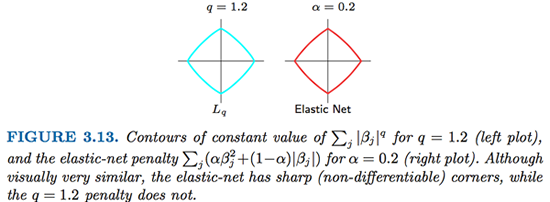

--- &triple w1:41% w2:55% 

## Beyond LASSO - Elastic Net

### More Advantages of E-Net
- selects variables like LASSO, and shrinks together the coefficients of correlated predictors like ridge.
- has considerable computational advantages over the $l_q$ penalties. 
    - See 18.4 [Elements of Statistical Learning]

### Elastic Net

*** left

- <b>Penalty Term</b>
$$\lambda \sum_{j = 1}^p (\alpha \beta_j^2 + (1-\alpha)|\beta_j|)$$
which is a compromise between ridge regression and LASSO and $\alpha \in [0,1]$.

*** right

---

## Elastic Net - A simple illustration

- Two independent “hidden” factors $\mathbf{z}_1$ and $\mathbf{z}_2$
$$\mathbf{z}_1 \sim U(0, 20),\quad \mathbf{z}_2 \sim U(0, 20),$$
- Generate the response vector $\mathbf{y} = \mathbf{z}_1 + 0.1\mathbf{z}_2 + N(0,1)$
- Suppose the observed features are
$$\mathbf{x}_1 = \mathbf{z}_1 + \epsilon_1,\quad \mathbf{x}_2 = -\mathbf{z}_1 + \epsilon_2,\quad \mathbf{x}_3 = \mathbf{z}_1 + \epsilon_3$$
$$\mathbf{x}_4 = \mathbf{z}_2 + \epsilon_4,\quad \mathbf{x}_5 = -\mathbf{z}_2 + \epsilon_5,\quad \mathbf{x}_6 = \mathbf{z}_2 + \epsilon_6$$
where $\epsilon$ is $i.i.d.$ random noise.
- Fit the model on data $(\mathbf{X}, \mathbf{y})$
- A good model should identify that only $\mathbf{x}_1, \mathbf{x}_2, \mathbf{x}_3$ are important

---

## Elastic Net - A simple illustration

---

## Elastic Net - A simple illustration

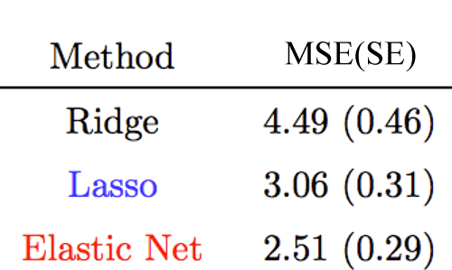

--- 

## Beyond LASSO - Fused Lasso

### Problems with LASSO

1. LASSO tends to rather arbitrarily select one of a group of highly correlated variables (see how LAR works). Sometimes, it is better to select <b>ALL</b> the relevant varibles in a group
2. LASSO selects at most $N$ variables, when $p > N$, which may be undesirable when $p >> N$
3. The performance of Ridge dominates that of LASSO, when $N > p$ and variables are correlated
4. LASSO does not consider about the prior information of the structure over input or output variables

Fused LASSO can solve the $4th$ problem for a specific kind of prior.

---

## Beyond LASSO - Fused LASSO

### Fused LASSO

- <b>Intuition</b>
    - Fused LASSO is designed for problems with features that can be ordered in some meaningful way, where "adjacent features" should have similar importance
    - Fused LASSO penalizes the $L_1$-norm of both the coefficients and their successive differences
- <b>Example</b>
    - Classification with fMRI data: each voxel has about 200 measurements over time. The coefficients for adjacent voxels should be similar
- <b>Formulation</b>

$$\hat{\beta} = argmin_{\beta}\{\|\mathbf{X\beta - y}\|_2^2\}$$
$$s.t. \|\beta\| \leq s_1 \quad and \quad \sum_{j = 2}^p |\beta_j - \beta_{j-1}| \leq s_2$$

---

## Beyond LASSO - Fused LASSO

### Fused LASSO

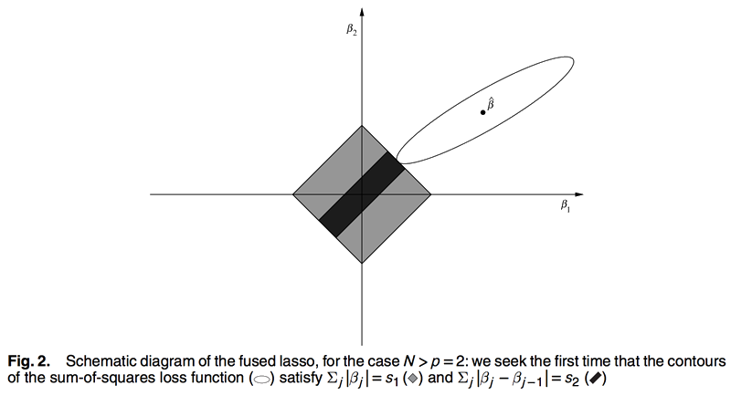

---

## Fused LASSO - Simulation results

- $p = 100$. Black lines are the true coefficients.
- (a) Univariate regression coefficients (red), a soft threshold version of them (green)
- (b) LASSO solution (red), $s_1 = 35.6,\quad s_2 = \infty$
- (c) Fusion estimate, $s_1 = \infty, \quad s_2 = 26$
- (d) Fused LASSO, $s_1 = \sum |\beta_j|,\quad s_2 = \sum |\beta_j - \beta_{j-1}|$

--- 

## Beyond LASSO - Group LASSO

### Problems with LASSO

1. LASSO tends to rather arbitrarily select one of a group of highly correlated variables (see how LAR works). Sometimes, it is better to select <b>ALL</b> the relevant varibles in a group
2. LASSO selects at most $N$ variables, when $p > N$, which may be undesirable when $p >> N$
3. The performance of Ridge dominates that of LASSO, when $N > p$ and variables are correlated
4. LASSO does not consider about the prior information of the structure over input or output variables

Group LASSO can solve the $1st$ and the $4th$ problem for a specific kind of prior
- Differences in the way Group LASSO and Elastic Net solve the $1st$ Problem
    - Group LASSO: Prior information about group structures is needed
    - Elastic Net: Prior information is not needed and the algorithm detects the group itself

---

## Beyond LASSO - Group LASSO

### Group LASSO

- <b>Intuition</b>
    - Features are divided into $L$ groups
    - Features within the same group should share similar coefficients
- <b>Example</b>
    - Binary dummy variables from one single discrete variable, e.g. $stage\_cancer \in \{1,2,3\}$ can be translated into three binary dummy variables $(stage1, stage2, stage3)$ 
- <b>Formulations</b>
$$obj = \left\|\mathbf{y} - \sum_{l = 1}^L \mathbf{X}_l \beta_l \right\|_2^2 + \lambda_1 \sum_{l = 1}^L\left\|\beta_l\right\|_2 + \lambda_2 \left\|\beta\right\|_1$$

---

## Group LASSO - Simulation Results

- Generate $n = 200$ observations with $p = 100$, divided into ten blocks equally
- The number of non-zero coefficients in blocks are 

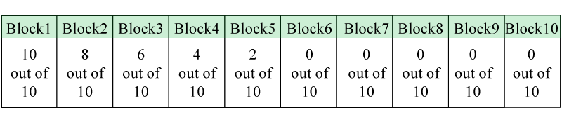

- The coefficients are either -1 or +1, with the sign being chosen randomly.
- The predictors are standard Gaussian with correlation 0.2 within a group and zero otherwise
- A Gaussian noise with standard deviation 4.0 was added to each observation

---

## Group LASSO - Simulation Results

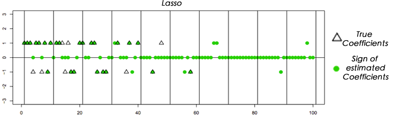

Group structures are not discovered by LASSO.

---

## Group LASSO - Simulation Results

--- 

## Beyond LASSO - $l_1-l_p$ penalization

### Problems with LASSO

1. LASSO tends to rather arbitrarily select one of a group of highly correlated variables (see how LAR works). Sometimes, it is better to select <b>ALL</b> the relevant varibles in a group
2. LASSO selects at most $N$ variables, when $p > N$, which may be undesirable when $p >> N$
3. The performance of Ridge dominates that of LASSO, when $N > p$ and variables are correlated
4. LASSO does not consider about the prior information of the structure over input or output variables

$l_1$-$l_p$ penalization solves the $4th$ problem by dealing with prior information of structures over output variables

---

## Beyond LASSO - $l_1$-$l_p$ penalization

### $l_1$-$l_p$ penalization

- <b>Applies to multi-task learning</b>, where the goal is to estimate predictive models for several related tasks. 
- <b>Examples</b>
    - <b>Example 1</b>: recognize speech of different speakers, or handwriting of different writers, 
    - <b>Example 2</b>: learn to control a robot for grasping different objects
    - <b>Example 3</b>:learn to control a robot for driving in different landscapes 
- <b>Assumptions about the tasks</b>
    - sufficiently <i>different</i> that learning a specific model for each task results in improved performance
    - <i>similar</i> enough that they share some common underlying representation that should make simul- taneous learning beneficial. 
    - different tasks share a subset of relevant features selected from a large common space of features.

---

## Beyond LASSO - $l_1$-$l_p$ penalization

### $l_1$-$l_p$ penalization

- <b>Formulation</b>
    - $\mathbf{X}_l$: $N \times p$ input matrix for task $l = 1..L$
        - $L$ is the total number of tasks
    - $\beta$: $p \times L$ coefficient matrix
    - $\mathbf{y}$: $N \times L$ output matrix
    - objective function
        $$obj = \sum_{l= 1}^L J(\beta_{:l}, \mathbf{X}_l, \mathbf{y}_{:l}) + \lambda \sum_{j = 1}^p \|\beta_{j:}\|_2$$
      where $J$ is some loss function and $\sum_{j = 1}^p \|\beta_{:j}\|_2$ is the $l_1$ norm of vector $(\|\beta_{:1}\|_2, \|\beta_{:2}\|_2, ..., \|\beta_{:p}\|_2)$.
    

---

## Beyond LASSO - $l_1-l_p$ penalization

### $l_1-l_p$ penalization -Coefficient matrix

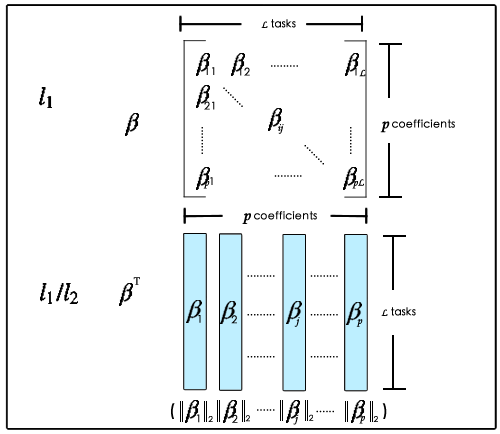

---

## $l_1-l_p$ penalization - Experiment Result

- <b>Dataset</b>: handwritten words dataset collected by Rob Kassel
    - Contains writings from more than 180 different writers.
    - For each writer, the number of each letter we have is between 4 and 30
    - The letters are originally represented as $8 \times 16$
- <b>Task</b>: build binary classiers that discriminate between pairs of letters. Specically concentrat on the pairs of letters that are the most difficult to distinguish when written by hand.    
- <b>Experiment</b>: learned classications of 9 pairs of letters for 40 different writers

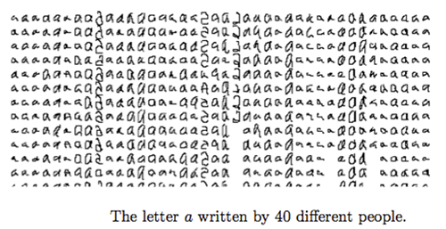

---

## $l_1-l_p$ penalization - Experiment Result

- <b>Candidate methods</b>
    - Pool $l_1$: a classifier is trained on all data regardless of writers
    - Independent $l_1$ regularization: For each writer, a classifier is trained
    - $l_1/l_1$-regularization:
    $$obj = \sum_{l= 1}^L J(\beta_{:l}, \mathbf{X}_l, \mathbf{y}_{:l}) + \lambda \sum_{l = 1}^L \|\beta_{:l}\|_1$$
    - $l_1/l_2$-regularization:
    $$obj = \sum_{l= 1}^L J(\beta_{:l}, \mathbf{X}_l, \mathbf{y}_{:l}) + \lambda \sum_{j = 1}^p \|\beta_{j:}\|_2$$    
   
---

---

## $l_1-l_p$ penalization - Experiment Result

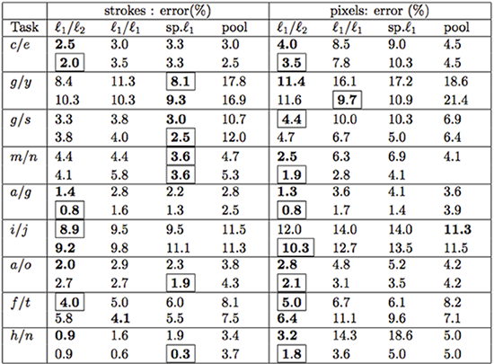

- Within a cell,  the first row contains results for feature selection, the second row uses random projections to obtain a common subspace (details omitted, see paper: Multi-task feature selection)
- Bold: best of $l_1/l_2$,$l_1/l_1$, $sp.l_1$ or pooled $l_1$, Boxed : best of cell

--- 

## Beyond LASSO - Graph-Guided Fused Lasso

### Problems with LASSO

1. LASSO tends to rather arbitrarily select one of a group of highly correlated variables (see how LAR works). Sometimes, it is better to select <b>ALL</b> the relevant varibles in a group
2. LASSO selects at most $N$ variables, when $p > N$, which may be undesirable when $p >> N$
3. The performance of Ridge dominates that of LASSO, when $N > p$ and variables are correlated
4. LASSO does not consider about the prior information of the structure over input or output variables

Graph-Guided Fused LASSO (GFLASSO) solves the $4th$ problem by dealing with prior information of structures over output variables
- More general than $l_1/l_p$, as abitrary graphical structures over the output variables can be encoded as priors in GFLASSO

---

## Beyond LASSO - GFLASSO

### Graph-Guided Fused LASSO

- <b>Example</b>

- <b>Formulation</b>
Graph-Guided LASSO applies to multi-task settings
$$obj = \sum_{l= 1}^L loss(\beta_{:l}, \mathbf{X}_l, \mathbf{y}_{:l}) + \lambda \|\beta\|_1+\gamma \sum_{(a,b)\in E}^p \tau(r_{ab}) \sum_{j = 1}^p |\beta_{ja} - sign(r_{a,b})\beta_{jb}|$$
where $r_{a,b} \in \mathbb{R}$ denotes the weight of the edge and $\tau(r)$ can be any user specified positive monotonically increasing function of $|r|$
    - e.g. $\tau(r) = |r|$.

---&twocol

## Beyond LASSO - GFLASSO

### GFLASSO

*** left

- (a) The true regression coefficients
- (c) $l_1/l_2$-regularized multi-task regression

*** right

- (b) LASSO
- (d) GFLASSO

---

## Summary

### Outline

- <h3>Introduction to Dimensionality Reduction</h3>

- <h3>Linear Regression and Least Squares (Review)</h3>

- <h3>Subset Selection</h3>

- <h3>Shrinkage Methods</h3>

- <h3>Beyond LASSO</h3>

---

## Summary

- Feature selection vs feature extraction
    - Feature selection: can save cost, be interpreted
    - Feature extraction: more general, often leads to better performance
- Linear models: Least Squares, Subset Selection, Ridge, LASSO:
    - Least Squares is unbiased, but can have high variance (as includes all features)
    - Ridge ($l_2$ regularization): constrains parameter values, to reduce variance
    - Subset Selection, LASSO: finds subset of features (to reduce variance)
    - LASSO uses $l_1$ regularization 
- LAR is like LASSO ( ($l_1$ regularization), but 
    - Their behaviors become different, when an coefficient hits zero
    - Modification: drops the feature, when its coefficient hits zero

---

## Summary II

- QP solves LASSO for a single $\lambda$, while LAR can solve LASSO for all $\lambda$
- Bayesian prior interpretation for Subset Selection, Ridge and LASSO
- Beyond LASSO (all use L1 regularization)
    - Elastic Net -- both L1 and L2
    - fused LASSO: coefficients of adjacent features are similar
    - group LASSO: feautures share similar coefficients within groups
    - $l_1/l_2$: similarities in multi-task
    - GFlasso: incorporates structure on output variables
    

---

## More on the topics skipped here

- More on feature extraction methods: 
    - http://www.cs.otago.ac.nz/cosc453/student_tutorials/principal_components.pdf
    - Imola K. Fodor, A survey of Dimensionality Reduction techniques
    - Christopher J. C. Burges, Dimensionality Reduction: A Guided Tour
- Mutual-info-based feature selection: 
    - Gavin Brown, Adam Pocock, Ming-Jie Zhao, Mikel Luján; Conditional Likelihood Maximisation: A Unifying Framework for Information Theoretic Feature Selection
    - Howard Hua Yang, John Moody. Feature Selection Based on Joint Mutual Information
    - Hanchuan Peng, Fuhui Long, and Chris Ding. Feature selection based on mutual information: criteria of max-dependency, max-relevance, and min-redundancy
- Beyond LASSO
    - http://webdocs.cs.ualberta.ca/~mahdavif/ReadingGroup/
- ELEN E6898 Sparse Signal Modeling 
    - https://sites.google.com/site/eecs6898sparse2011/home

--- &vcenter  

## Sparse Models

### Thank You!

---

## Reference

- Trevor Hastie, Robert Tibshirani and Jerome Friedman. Elements of Statistical Learning [p7, p15, p16, p18, p19, p21-22, p26-27, p29-30, p33, p35-37, p42-p43, p50-p54, p56, p59]
- Temporal Sequence of FMRI scans (single slice): from http://www.midwest-medical.net/mri.sagittal.head.jpg [p8]
- Three Dimensional Image of Brain Activation from http://www.fmrib.ox.ac.uk/fmri_intro/brief.html [p8]
- http://en.wikipedia.org/wiki/Feature_selection [p10-12]
- http://en.wikipedia.org/wiki/Singular_value_decomposition [p27]
- http://en.wikipedia.org/wiki/Normal_distribution [p38]
- http://en.wikipedia.org/wiki/Laplacian_distribution [p38]
- http://webdocs.cs.ualberta.ca/~mahdavif/ReadingGroup/Papers/larS.pdf [p20]
- Bradley Efron, Trevor Hastie, Iain Johnstone and Robert Tibshirani. Least Angle Regression [p20]
- http://www.stanford.edu/~hastie/TALKS/larstalk.pdf

---

## Reference
    
- Kevin P. Murphy. Machine Learning A Probabilistic Perspective[p59]
- Prof.Schuurmans' notes on LASSO [p40]
- Conditional Likelihood Maximisation: A Unifying Framework for
Information Theoretic Feature Selection [p8]
- Hui Zou and Trevor Hastie. Regularization and Variable Selection via the Elastic Net [p59-62]
- http://www.stanford.edu/~hastie/TALKS/enet_talk.pdf [p59-62]
- Robert Tibshirani and Michael Saunders, Sparsity and smoothness via the fused LASSO [P63-p65]
- Jerome Friedman Trevor Hastie and Robert Tibshirani. A note on the group LASSO and a sparse group LASSO [p66-68]
- Guillaume Obozinski, Ben Taskar, and Michael Jordan. Multi-task feature selection [p69-70, p72-p75]
- Xi Chen, Seyoung Kim, Qihang Lin, Jaime G. Carbonell, Eric P. Xing. Graph-Structured Multi-task Regression and an Efficient Optimization Method for General Fused LASSO [p76-77]

