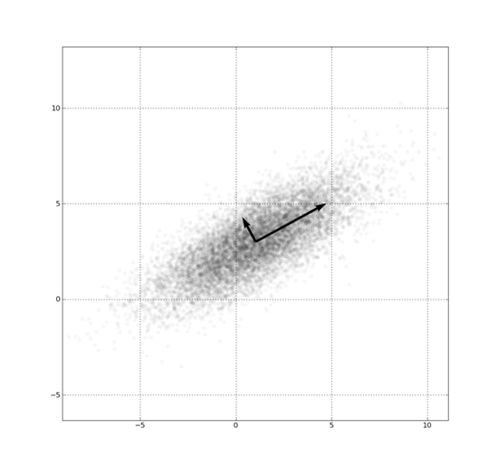
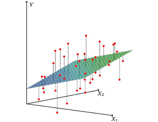
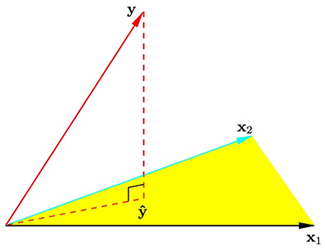

## Difference between Feature Selection and Feature Extraction

### Feature Selection

- chooses a subset of features from the original feature set

### Feature Extraction

- transforms the original features into new ones
- e.g. projects data from high dimensions to low dimensions

### Question: 

- Why do we need two frameworks for dimension reduction?

---

## Difference between Feature Selection and Feature Extraction

### Example 1: Prostate Cancer

The data come from a study by Stamey et al.(1989). In this task, we are trying to identify a subset of features that are useful for prediction of the level of prostate-specific antigen (lpsa). Our available feature set is 
$$\{lcavol, lweight, age, lbph, svi, lcp, gleason, pgg45\}.$$
In this case, we would like to have our result as a subset of the whole set, such as
$$\{lcavol, lweight, age, svi, lcp\},$$
which are important for prediction of lpsa.

Feature selection applies.

---

## Difference between Feature Selection and Feature Extraction

### Example 2: Embedded System with limited computation resource

Suppose we have a robot which possess many sensors, such as temperature sensor, light senor, cliff sensor, gas sensor, GPS, gyroscope and so on. And our task is to discriminate if the current situation is dangerous for the robot, according the data from these sensors. In this task, our computation resource is very limited due to 
- the CPU of the embedded system
- our battery capacity. 

Hence, we would prefer that our prediction task involves computation as little as possible. Then a compact model with less features from sensors would be preferred. 

Feature selection applies.

---

## Difference between Feature Selection and Feature Extraction

### Example 3: classification with fMRI data

fMRI data are 4D images, with one dimension being the time slot. Imagining that one snapshot of it is a $50 \times 50 \times 50$ image and we have 200 time points, then the total number of dimensions for just one image will be $50 \times 50 \times 50 \times 200 = 25,000,000$, which will cause great computation burdun. 

In this task, we are not concerned about importance of particular voxels. Our purpose is to decrease the number of dimensions without losing too much information for further prediction task.

Feature extraction applies.

---

## Feature Selection

### Wrapper Methods

- search the space of feature subsets
- use the training/validation accuracy of a particular classifier as the measure of utility for a candidate subset.

### Embedded Methods
- exploit the structure of specific classes of learning models to guide the feature selection process, 
- e.g. LASSO[1]. It is embedded as part of the model construction process[2].

### Filter Methods

- use some general rules/criterions to measure the feature selection results, independent of the classifiers, 
- e.g. mutual information based method[1].

---

## Feature Selection

### Comparison

|               | Wrapper       | Filter| Embedded|
| ----------- |:-------------:| -----:|-----:|
| Speed               | Low     | High  | Mid|
| Chance of Overfitting| High   | Low   | Mid|
| Classifier-Independent | No   | Yes   | No  |

--- &twocolportion w1:40% w2:60%

## Feature Extraction   

*** left

- <b>A graphical explanation</b>
    - Each data sample has two features
    - Prefer the direction with larger variance
    - Original features are transformed into new ones

*** right

---

## Part 2: Linear Regression and Least Squares (Review)

- Introduction to Dimension Reduction
- <b>Linear Regression and Least Squares (Review)</b>
    - <b>Least Square Fit</b>
    - <b>Gauss Markov</b>
    - <b>Bias-Variance tradeoff</b>
    - <b>Problems</b>
- Subset Selection
- Shrinkage Method
- Beyond Lasso

--- &twocolportion w1:58% w2:38%

## Linear Regression and Least Squares (Review)

*** left

### Least Squares Fit

$$
\begin{equation}
\begin{split}
RSS(\beta) &= (\mathbf{y} - \mathbf{X}\beta)^T(\mathbf{y} - \mathbf{X}\beta)\\
\frac{\partial RSS}{\partial \beta} &= -2 \mathbf{X}^T(\mathbf{y} - \mathbf{X}\beta)\\
\hat{\beta} &= (\mathbf{X}^T\mathbf{X})^{-1}\mathbf{X}^T\mathbf{y}
\end{split}
\end{equation}
$$

### Gauss Markov Theorem

The least squares estimates of the parameters β have the smallest variance among all linear unbiased estimates.

### Question

Is unbiased assumption necessary?

*** right

---

## Part 3: Subset Selection

- Introduction to Dimension Reduction
- Linear Regression and Least Squares (Review)
- <b>Subset Selection</b>
  - <b>Best-subset selection</b>
  - <b>Forward stepwise selection</b>
  - <b>Forward stagewise selection</b>
  - <b>Problems</b>
- Shrinkage Method
- Beyond Lasso

---

## Linear Regression and Least Squares (Review)

### Bias-Variance tradeoff
$$
\begin{equation}
\begin{split}
MSE(\tilde{\theta} &= E[(\tilde{\theta} - \theta)^2])\\
&= Var(\tilde{\theta} + [E[\tilde{\theta}] - \theta])
\end{split}
\end{equation}
$$

where $\theta = \alpha^T \beta$. We can trade some bias for much less variance.

### Problems of Least Squares

- Prediction accuracy: low bias, but high variance, overfitting noise and sensitive to outlier
- Interpretation: Sometimes, especially when faced with numerous features, we may want a "big picture" of the model
- $(\mathbf{X}^T\mathbf{X})$ may be invertible and thus no closed form solution

---

## Subset Selection

### Best-subset selection

> - Best subset regression finds for each $k \in \{0, 1, 2, . . . , p\}$ the subset of size $k$ that gives smallest residual sum of squares. 
- An efficient algorithm, the leaps and bounds procedure (Furnival and Wilson, 1974), makes this feasible for p as large as 30 or 40.

--- &vcenter
## .

## Thank you

