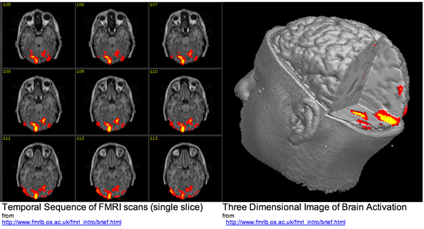
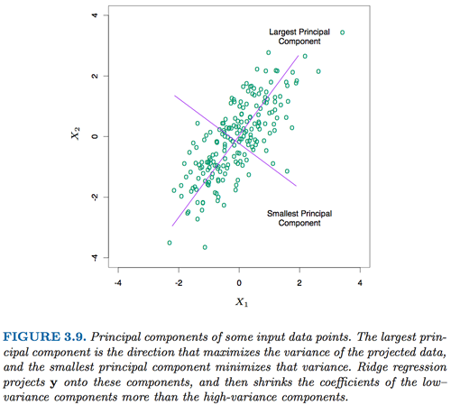
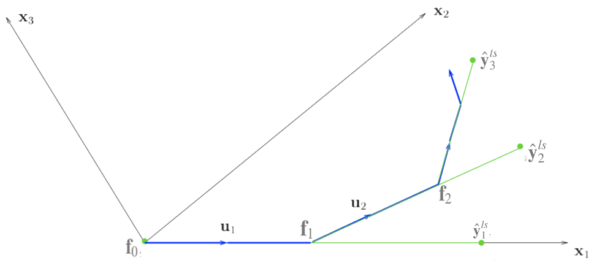

## Difference between Feature Selection and Feature Extraction

### Feature Selection

- chooses a subset of features from the original feature set

### Feature Extraction

- transforms the original features into new ones
- e.g. projects data from high dimensions to low dimensions

### Question: 

- Why do we need two frameworks for dimension reduction?

---

## Difference between Feature Selection and Feature Extraction

### Example 1: Prostate Cancer

The data come from a study by Stamey et al.(1989). In this task, we are trying to identify a subset of features that are useful for prediction of the level of prostate-specific antigen (lpsa). Our available feature set is 
$$\{lcavol, lweight, age, lbph, svi, lcp, gleason, pgg45\}.$$
In this case, we would like to have our result as a subset of the whole set, such as
$$\{lcavol, lweight, age, svi, lcp\},$$
which are important for prediction of lpsa.

Feature selection applies.

---

## Difference between Feature Selection and Feature Extraction

### Example 2: Embedded System with limited computation resource

Suppose we have a robot which possess many sensors, such as temperature sensor, light senor, cliff sensor, gas sensor, GPS, gyroscope and so on. And our task is to discriminate if the current situation is dangerous for the robot, according the data from these sensors. In this task, our computation resource is very limited due to 
- the CPU of the embedded system
- our battery capacity. 

Hence, we would prefer that our prediction task involves computation as little as possible. Then a compact model with less features from sensors would be preferred. 

Feature selection applies.

---

## Difference between Feature Selection and Feature Extraction

### Example 3: classification with fMRI data
fMRI data are 4D images, with one dimension being the time slot.

---

## Difference between Feature Selection and Feature Extraction

### Example 3: classification with fMRI data

- fMRI data are 4D images, with one dimension being the time slot. 

- Suppose the dimension of images is $50 \times 50 \times 50$ for single time point and we have 200 time points

- $50 \times 50 \times 50 \times 200 = 25,000,000$ dimensions in total! This will cause great computation burdun

In this task, we are not concerned about importance of particular voxels. Our purpose is to decrease the number of dimensions without losing too much information for further prediction task. 

Feature extraction applies better.

---

## Feature Selection

### Wrapper Methods

- search the space of feature subsets
- use the training/validation accuracy of a particular classifier as the measure of utility for a candidate subset.

### Embedded Methods
- exploit the structure of specific classes of learning models to guide the feature selection process, 
- e.g. LASSO[1]. It is embedded as part of the model construction process[2].

### Filter Methods

- use some general rules/criterions to measure the feature selection results, independent of the classifiers, 
- e.g. mutual information based method[1].

---

## Feature Selection

### Comparison

|               | Wrapper       | Filter| Embedded|
| ----------- |:-------------:| -----:|-----:|
| Speed               | Low     | High  | Mid|
| Chance of Overfitting| High   | Low   | Mid|
| Classifier-Independent | No   | Yes   | No  |

--- &twocolportion w1:40% w2:60%

## Feature Extraction   

*** left

- <b>A graphical explanation</b>
    - Each data sample has two features
    - Prefer the direction with larger variance
    - Original features are transformed into new ones

*** right

---

## Part 2: Linear Regression and Least Squares (Review)

- Introduction to Dimension Reduction
- <b>Linear Regression and Least Squares (Review)</b>
    - <b>Least Square Fit</b>
    - <b>Gauss Markov</b>
    - <b>Bias-Variance tradeoff</b>
    - <b>Problems</b>
- Subset Selection
- Shrinkage Method
- Beyond Lasso

--- &twocolportion w1:58% w2:38%

## Linear Regression and Least Squares (Review)

*** left

### Least Squares Fit

$$
\begin{equation}
\begin{split}
RSS(\beta) &= (\mathbf{y} - \mathbf{X}\beta)^T(\mathbf{y} - \mathbf{X}\beta)\\
\frac{\partial RSS}{\partial \beta} &= -2 \mathbf{X}^T(\mathbf{y} - \mathbf{X}\beta)\\
\hat{\beta} &= (\mathbf{X}^T\mathbf{X})^{-1}\mathbf{X}^T\mathbf{y}
\end{split}
\end{equation}
$$

### Gauss Markov Theorem

The least squares estimates of the parameters β have the smallest variance among all linear unbiased estimates.

### Question

Is unbiased assumption necessary?

*** right

---

## Part 3: Subset Selection

- Introduction to Dimension Reduction
- Linear Regression and Least Squares (Review)
- <b>Subset Selection</b>
  - <b>Best-subset selection</b>
  - <b>Forward stepwise selection</b>
  - <b>Forward stagewise selection</b>
  - <b>Problems</b>
- Shrinkage Method
- Beyond Lasso

---

## Linear Regression and Least Squares (Review)

### Bias-Variance tradeoff
$$
\begin{equation}
\begin{split}
MSE(\tilde{\theta} &= E[(\tilde{\theta} - \theta)^2])\\
&= Var(\tilde{\theta} + [E[\tilde{\theta}] - \theta])
\end{split}
\end{equation}
$$

where $\theta = \alpha^T \beta$. We can trade some bias for much less variance.

### Problems of Least Squares

- Prediction accuracy: low bias, but high variance, overfitting noise and sensitive to outlier
- Interpretation: Sometimes, especially when faced with numerous features, we may want a "big picture" of the model
- $(\mathbf{X}^T\mathbf{X})$ may be invertible and thus no closed form solution

---

## Subset Selection

### Best-subset selection

- Best subset regression finds for each $k \in \{0, 1, 2, . . . , p\}$ the subset of size $k$ that gives smallest residual sum of squares.
- An efficient algorithm, the leaps and bounds procedure (Furnival and Wilson, 1974), makes this feasible for p as large as 30 or 40.[]

---

## Subset Selection

### Forward-stepwise selection

Instead of searching all possible subsets, we can seek a good path through them.

*Forward-Stepwise Selection* builds a model sequentially, adding one variable at a time. At each step, it

- identifies the best variable (with the highest correlation with the residual error) to include in the *active set*
$$\mathbf{x_k} = argmax_{\mathbf{x}_j}(|\mathbf{x}^T_j \mathbf{r}|)$$
- then updates the least squares fit to include all the active variables

--- &twocolportion w1:45% w2:50%

## Subset Selection

### Forward-Stagewise Regression

*** left
- Initialize the fit vector $\mathbf{f} = 0$
- Compute the correlation vector 
$$\mathbf{c} = \mathbf{c}(\mathbf{f}) = \mathbf{X}^T(\mathbf{y} - \mathbf{f})$$
- $k = argmax_{j \in \{1,2,..,p\}} |\mathbf{c}_j|$
- Coefficients and fit vector are updated
$$\mathbf{f} \gets \mathbf{f} + \alpha \cdot sign(\mathbf{c}_j) \mathbf{x}_j$$
$$\beta_j \gets \beta_j + \alpha \cdot sign(\mathbf{c}_j)$$ 

***right

---&twocolportion w1:40% w2:55%

## Subset Selection

### Comparison
*** left
- It takes at most $p$ steps for forward-stepwise selection to get the final fit
- Forward stagewise selection is a slow fitting algorithm, at each time step we only update one $\beta_j$, which can take more than $p$ steps
- Forward stagewise is useful in high dimensional problem

*** right

---

## Subset Selection

### Pros

- More interpretable and compact model

### Cons

- It is a discrete process, and thus has high variance and sensitivity to the change in dataset.
- Thus may not be able to lower prediction error

---

## Ridge Regression

- Introduction to Dimension Reduction
- Linear Regression and Least Squares (Review)
- <b>Shrinkage Method</b>
    - <b>Ridge Regression</b>
        - <b>Formulations and closed form solution</b>
        - <b>Singular value decomposition</b>
        - <b>Degree of Freedom</b>
    - Lasso
- Beyond Lasso

---

## Ridge Regression

- <b>Linear regression with $l2$-regularization</b>
    - Least squares with quadratic constraints
$$
\begin{equation}
\hat{\beta}^{ridge}= argmin_{\beta}\sum_{i=1}^N(y_i - \beta_0 - \sum_{j=1}^p\mathbf{x_{ij}}\beta_j)^2, s.t. \sum_{j = 1}^p \beta_j^2 \leq t
\end{equation}
$$
    - Its dual form
$$
\hat{\beta}^{ridge} = argmin_{\beta}\{\sum_{i=1}^N(y_i - \beta_0 - \sum_{j=1}^p\mathbf{x_{ij}}\beta_j)^2 + \lambda \sum_{j = 1}^p\beta_j^2\}
$$
    - The L2-regularization can be viewed as a Gaussian prior on the coefficients, and our estimates are the posterior means
- <b>Solution</b>
$$
\begin{equation}
\begin{split}
&RSS(\lambda) = (\mathbf{y} - \mathbf{X}\beta)^T(\mathbf{y} - \mathbf{X}\beta) + \lambda \beta^T\beta\\
&\hat{\beta}^{ridge} = (\mathbf{X}^T\mathbf{X} + \lambda \mathbf{I})^{-1}\mathbf{X}^T\mathbf{y}
\end{split}
\end{equation}
$$    

---

## Ridge Regression

### Singular Value Decomposition (SVD)
- The SVD of $\mathbf{X}$:
$$\mathbf{X} = \mathbf{UDV}^T$$
    - $\mathbf{U}$: $N \times p$ <b>orthogonal</b> matrix with columns spanning the column space of $\mathbf{X}$
    - $\mathbf{V}$: $p \times p$ <b>orthogonal</b> matrix with columns spanning the row space of $\mathbf{X}$  
    - $\mathbf{D}$: $p \times p$ <b>diagonal</b> matrix with diagonal entries $d_1 \geq d_2 \geq ... \geq d_p \geq 0$ being the singular values of $\mathbf{X}$
- For least squares
$$
\begin{equation}
\begin{split}
\mathbf{X}\hat{\beta}^{ls} &= \mathbf{X(X^TX)^{-1}X^Ty}\\
&=\mathbf{UU^Ty}
\end{split}
\end{equation}
$$

---

## Ridge Regression

### Singular Value Decomposition (SVD)
- For ridge regression
$$
\begin{equation}
\begin{split}
\mathbf{X}\hat{\beta}^{ridge} &= \mathbf{X(X^TX + \lambda I)^{-1}X^Ty}\\
&=\sum_{j=1}^p\mathbf{u}_j\frac{d_j^2}{d_j^2 + \lambda} \mathbf{u}_j^T\mathbf{y}
\end{split}
\end{equation}
$$
    - Compared with the solution of least square, we have an additional shrinkage term, the smaller d is and the larger λ is, the more shrinkage we have. 
- The SVD of the centered matrix $X$ is another way of expressing the principal components of the variables in $X$. 

---

## Ridge Regression

### Singular Value Decomposition (SVD) 

--- &twocolportion w1:40% w2:55%

## Ridge Regression

### Degree of Freedom

*** left
- In statistics, the number of degrees of freedom is the number of values in the final calculation of a statistic that are free to vary.
- Computation
$$
\begin{equation}
\begin{split}
d(\lambda) &= tr[\mathbf{X(X^TX + \lambda I)^{-1}X^T}]\\
&=tr[\mathbf{H_{\lambda}}]\\
&=\sum_{j=1}^p \frac{d_j^2}{d_j^2 + \lambda} 
\end{split}
\end{equation}
$$
- The smaller $d$ is and the larger $\lambda$ is, the less degree of freedom we have

*** right

---

## LASSO

- Introduction to Dimension Reduction
- Linear Regression and Least Squares (Review)
- <b>Shrinkage Method</b>
    - Ridge Regression
    - <b>Lasso</b>
        - <b>Formulations</b>
        - <b>Comparisons with ridge regression and subset selection</b>
        - <b>Quadratic Programming</b>
        - <b>Least Angle Regression</b>
        - <b>Viewed as approximation for $l0$-regularization</b>
- Beyond Lasso

---

## LASSO

### Linear regression with $l1$-regularization

- Problems with $l2$-regularization
    - Interpretability and compactness: Though coefficients are shrinked, but not to zero.
    
    - Least squares with constraints
$$
\begin{equation}
\hat{\beta}^{ridge}= argmin_{\beta}\sum_{i=1}^N(y_i - \beta_0 - \sum_{j=1}^p\mathbf{x_{ij}}\beta_j)^2, s.t. \sum_{j = 1}^p |\beta_j| \leq t
\end{equation}
$$
    - Its dual form
$$
\hat{\beta}^{ridge} = argmin_{\beta}\{\sum_{i=1}^N(y_i - \beta_0 - \sum_{j=1}^p\mathbf{x_{ij}}\beta_j)^2 + \lambda \sum_{j = 1}^p|\beta_j|\}
$$
    - The $11$-regularization can be viewed as a Laplace prior on the coefficients

---

## LASSO

---

## LASSO

- Introduction to Dimension Reduction
- Linear Regression and Least Squares (Review)
- <b>Shrinkage Method</b>
    - Ridge Regression
    - <b>Lasso</b>
        - Formulations
        - <b>Comparisons with ridge regression and subset selection</b>
            - <b>Orthonormal inputs</b>
            - <b>Non-orthonormal inputs</b>
        - Quadratic Programming
        - Least Angle Regression
        - Viewed as approximation for $l0$-regularization
- Beyond Lasso

---

## LASSO

### Comparison

- Orthonormal Input $\mathbf{X}$
    - <b>Best subset</b>: [Hard thresholding] Only keep the top $M$ largest coefficeints of $\hat{\beta}^{ls}$
    - <b>Ridge</b>: [Pure shrinkage] does proportionally shrinkage of $\hat{\beta}^{ls}$
    - <b>Lasso</b>: [Soft thresholding] translates each coefficient of $\hat{\beta}^{ls}$ by $\lambda$, truncating at 0 

---

## LASSO

### Comparison

- Non-orthonormal Input $\mathbf{X}$

---

## LASSO

### Other unit circles for different $p$-norms

|   |Convex| Smooth| Sparse|
|----|----|----|----|
|$q<1$|No|No|Yes|
|$q>1$|Yes|Yes|No|
|$q = 1$|Yes|No|Yes|

Here $q = 0$ is the pure variable selection procedure, as it is counting the <b>number of non-zero coefficients</b>.

--- &twocolportion w1:48% w2:48%

## LASSO

### Regularizations as priors

$|\beta_j|^q$ can be viewed as the log-prior density for $\beta_j$, these three methods are bayes estimates with different priors

- <b>Subset selection</b>: corresponds to $q = 0$
- <b>LASSO</b>: corresponds to $q = 1$, Laplace prior, $density = (\frac{1}{\tau})exp(\frac{-|\beta|}{\tau}), \tau = 1/\lambda$
- <b>Ridge regression</b>: corresponds to $q = 2$, Gaussian Prior

*** left

*** right

---

## LASSO

- Introduction to Dimension Reduction
- Linear Regression and Least Squares (Review)
- <b>Shrinkage Method</b>
    - Ridge Regression
    - <b>Lasso</b>
        - Formulations
        - Comparisons with ridge regression and subset selection
        - <b>Quadratic Programming</b>
        - Least Angle Regression
        - Viewed as approximation for $l0$-regularization
- Beyond Lasso

---

## LASSO

### Quadratic Programming

- Formulation
$$
min_{\beta}\{ \frac{1}{2}(\mathbf{X}\beta - \mathbf{y})^T (\mathbf{X}\beta - \mathbf{y}) + \lambda \|\beta\|_1\}
$$
is equivalent to 
$$
min_{w, \xi}\{ \frac{1}{2}(\mathbf{X}\beta - \mathbf{y})^T (\mathbf{X}\beta - \mathbf{y}) + \lambda \mathbf{1}^T\xi\}
$$

$$
\begin{equation}
\begin{split}
s.t. &\beta_j \leq \xi_j\\
&\beta_j \geq -\xi_j
\end{split}
\end{equation}
$$

- Note that QP can only solve LASSO with a fixed $\lambda$

---

## LASSO

- Introduction to Dimension Reduction
- Linear Regression and Least Squares (Review)
- <b>Shrinkage Method</b>
    - Ridge Regression
    - <b>Lasso</b>
        - Formulations
        - Comparisons with ridge regression and subset selection
        - Quadratic Programming
        - <b>Least Angle Regression</b>
        - Viewed as approximation for $l0$-regularization
- Beyond Lasso

--- 

## Least Angle Regression

### Notations

- $\mathcal{A}_k$: <i>active set</i>, the set of features we already included in the model at time step $k$
- $\beta_{\mathcal{A}_k}$: coefficients vector at the beginning of time step $k$
- $\beta_{\mathcal{A}_k}(\alpha)$: coefficients vector in time step $k$ w.r.t. $\alpha$, 
- $\mathbf{f}_k$: the fit vector at the beginning of time step $k$, $\mathbf{f}_0 = 0$
- $\mathbf{f}_k(\alpha)$: the fit vector in time step $k$ w.r.t. $\alpha$
- $\mathbf{r}_k$: residual vector at the beginning of time step $k$, $\mathbf{r}_0 = \mathbf{y} - \bar{\mathbf{y}}$
- $\mathbf{r}_k(\alpha)$: residual vector in time step $k$, w.r.t. $\alpha$

---

## LAR Algorithm

- Initialization: 
    - Standardized all predictors s.t. $\bar{\mathbf{x}_j} = 0, \mathbf{x}_j^T\mathbf{x}_j = 1$; $\mathbf{r}_0 = \mathbf{y} - \bar{\mathbf{y}}$; $\beta = \mathbf{0}$; $\mathbf{f}_0 = \mathbf{0}$; $\mathcal{A}_k = \emptyset$
    - $\mathbf{x}_k = argmax_{\mathbf{x}_j} |\mathbf{x}_j^T \mathbf{r}_0|$, $\mathcal{A}_1 = \{\mathbf{x}_k\}$
- Main
    - While termination_cond != true
      - $\mathbf{r}_k = \mathbf{y} - \mathbf{X}_{\mathcal{A}_k} \beta_{\mathcal{A}_k}$, $\mathbf{f}_k = \mathbf{X}_{\mathcal{A}_k} \beta_{\mathcal{A}_k}$
      - Search $\alpha$
          - $\beta_{\mathcal{A}_k}(\alpha) = \mathcal{A}_k + \alpha \cdot \delta_k$, where $\delta_k = \mathbf{(X^T_{\mathcal{A}_k} X_{\mathcal{A}_k})^{-1} X^T_{\mathcal{A}_k}r_k}$
          - Concurrently, $\mathbf{f}_k(\alpha) = \mathbf{f}_k + \alpha \cdot \mathbf{u}_k$, where $\mathbf{u}_k = \mathbf{X}_{\mathcal{A}_k} \delta_k$
      - Until $|\mathbf{X}_{\mathcal{A}_k} \mathbf{r}_k(\alpha)| = max_{\mathbf{x}_j \in \bar{\mathcal{A}_k}} |\mathbf{x}_j^T \mathbf{r}_k(\alpha)|$
      - $\mathbf{x}_k = argmax_{\mathbf{x}_j \in \bar{\mathcal{A}_k}} \mathbf{x}_j \mathbf{r}_k(\alpha)$ 
      - $\mathcal{A}_{k+1} = \mathcal{A}_{k} \cup \{\mathbf{x}_k\}$

---

## LAR

### Comments

1. <b>Why called Least Angle</b>: the direction $\mathbf{u}_k = \mathbf{X}_{\mathcal{A}_k} \delta_k$ that our fit $\mathbf{f}_k(\alpha)$ increases actually has the same angle with any $\mathbf{x}_j \in \mathcal{A}_k$.
2. Note that the left-hand side of the termination condition for searching is a vector, while the right-hand side is a single value. 
$$|\mathbf{X}_{\mathcal{A}_k} \mathbf{r}_k(\alpha)| = max_{\mathbf{x}_j \in \bar{\mathcal{A}_k}} |\mathbf{x}_j^T \mathbf{r}_k(\alpha)|$$
This actually comes from the fact that the absolute values of correlations of $\mathbf{x}_j \in \mathcal{A}_k, \forall j$ with the residual error are tied and decrease at the same rate.
3. The procedure of searching is approaching the least-squares coefficients of fitting $\mathbf{y}$ on $\mathcal{A}_k$
4. LAR solves the subset selection problem for all $t, s.t. \|\beta\| \leq t$
5. Actually, $\alpha$ can be computed instead of searching

---

## LAR

### Example

--- &twocolportion w1:28% w2:72%

## LAR

### Result compared with LASSO

*** left

#### Observations:

When the blue line coefficient cross zero, LAR and LASSO become different.

*** right

---

## LAR

### Modification for LASSO

During the searching procedure, if a non-zero coefficient hits zero, drop this variable from $\mathcal{A}_k$, and recompute the direction $\delta_k$

### Some heuristic analysis

- At a certain time point, we know that all $\mathbf{x}_j \in \mathcal{A}$ share the same absolute values of correlations with the residual error. That is
$$\mathbf{x}_j^T(\mathbf{y} - \mathbf{X}\beta) = \gamma \cdot s_j, \forall \mathbf{x}_j \ \in \mathcal{A}$$
where $s_j \in \{-1,1\}$ indicates the sign of the left hand inner product and $\gamma$ is the common value. We also know that $|\mathbf{x_j}(\mathbf{y} - \mathbf{X}\beta)| \leq \gamma, \forall \mathbf{x}_j \not\in \mathcal{A}$

---

## LAR

### Some heuristic analysis

- At a certain time point, we know that all $\mathbf{x}_j \in \mathcal{A}$ share the same absolute values of correlations with the residual error. That is
$$\mathbf{x}_j^T(\mathbf{y} - \mathbf{X}\beta) = \gamma \cdot s_j, \forall \mathbf{x}_j \ \in \mathcal{A}$$
where $s_j \in \{-1,1\}$ indicates the sign of the left hand inner product and $\gamma$ is the common value. We also know that $|\mathbf{x_j}(\mathbf{y} - \mathbf{X}\beta)| \leq \gamma, \forall \mathbf{x}_j \not\in \mathcal{A}$

- Now consider about LASSO for a fixed given $\lambda$. Let $\mathcal{B}$ with non-zero coefficients, then we differentiate the objective function w.r.t. these non zero coefficients and set the gradient to zero
$$\mathbf{x}_j^T(\mathbf{y} - \mathbf{X}\beta) = \lambda \cdot sign(\beta_j), \forall j \in \mathcal{B}$$

- They are identical only if $sign(\beta_j)$ matches the sign of the lefthand side. In $\mathcal{A}$, we allow for the $\beta_j$, where $sign(\beta_j) \neq sign(correlation_j)$, while this is forbidden in $\mathcal{B}$. Thus, once a coefficent hits zero, we drop it.

---

## LAR

### Some heuristic analysis

-  For LAR, we have 
$$|\mathbf{x_j}(\mathbf{y} - \mathbf{X}\beta)| \leq \gamma, \forall \mathbf{x}_j \not\in \mathcal{A}$$
- According to the stationary conditions, for LASSO, we have
$$
|\mathbf{x}_j^T(\mathbf{y} - \mathbf{X}\beta)| \leq \lambda, \forall \mathbf{x}_j \not\in \mathcal{B}
$$
- They match for variables with zero coefficients too.

---

## LASSO

- Introduction to Dimension Reduction
- Linear Regression and Least Squares (Review)
- <b>Shrinkage Method</b>
    - Ridge Regression
    - <b>Lasso</b>
        - Formulations
        - Comparisons with ridge regression and subset selection
        - Quadratic Programming
        - Least Angle Regression
        - <b>Viewed as approximation for $l0$-regularization</b>
- Beyond Lasso

---

## Viewed as approximation for $l0$-regularization

### Pure variable selection

$$
\begin{equation}
\hat{\beta}^{ridge}= argmin_{\beta}\sum_{i=1}^N(y_i - \beta_0 - \sum_{j=1}^p\mathbf{x_{ij}}\beta_j)^2, s.t. \#nonzero \beta_j \leq t
\end{equation}
$$

Actually $\#nonzero \beta_j = \|\beta\|_0$, where

$$\|\beta\|_0 = lim_{q \to 0}(\sum_{j = 1}^p|\beta_j|^q)^{\frac{1}{q}} = card(\{\beta_j|\beta_j \neq 0\})$$

---

## Viewed as approximation for $l0$-regularization

### Problem

This norm is not convex, which makes it very hard to optimize.

### Solution

- <b>LASSO</b>: Approximated objective function ($l1$-norm), with exact optimization
- <b>Subset selection</b>: Exact objective function, with approximated optimization (greedy strategy)

---

## Beyond LASSO

- Introduction to Dimension Reduction
- Linear Regression and Least Squares (Review)
- Shrinkage Method
- <b>Beyond LASSO</b>
   - <b>Elastic-Net</b>
   - <b>$L1-lp$ norm</b>
   - <b>Fused Lasso</b>
   - <b>Group Lasso</b>
   - <b>Graph-guided Lasso</b>

--- &triple w1:41% w2:55% 

## Beyond LASSO

### $L1-lp$ norm

- Example

*** left

- Formualtion
$$\lambda \sum_{j = 1}^p (\alpha \beta_j^2 + (1-\alpha)|\beta_j|)$$
which is a compromise between ridge regression and LASSO.

*** right

*** down

- Advantages
    - The elastic-net selects variables like the lasso, and shrinks together the coefficients of correlated predictors like ridge.
    - It also has considerable computational advantages over the $Lq$ penalties. (detailed in Section 18.4 in Elements of Statistical Learning)

---

## Beyond LASSO

### $l1-lp$ penalization

- Applies to multi-task learning, where the goal is to estimate predictive models for several related tasks. 
- Examples:
    - <b>Example 1</b>: recognize speech of different speakers, or handwriting of different writers, 
    - <b>Example 2</b>: learn to control a robot for grasping different objects or drive in different landscapes, etc. 
- Assumptions about the tasks
    - sufficiently different that learning a specific model for each task results in improved performance
    - similar enough that they share some common underlying representation that should make simul- taneous learning beneficial. 
    - In particular, we focus on the scenario where the different tasks share a subset of relevant features to be selected from a large common space of features.

--- &vcenter  

## Thank you

